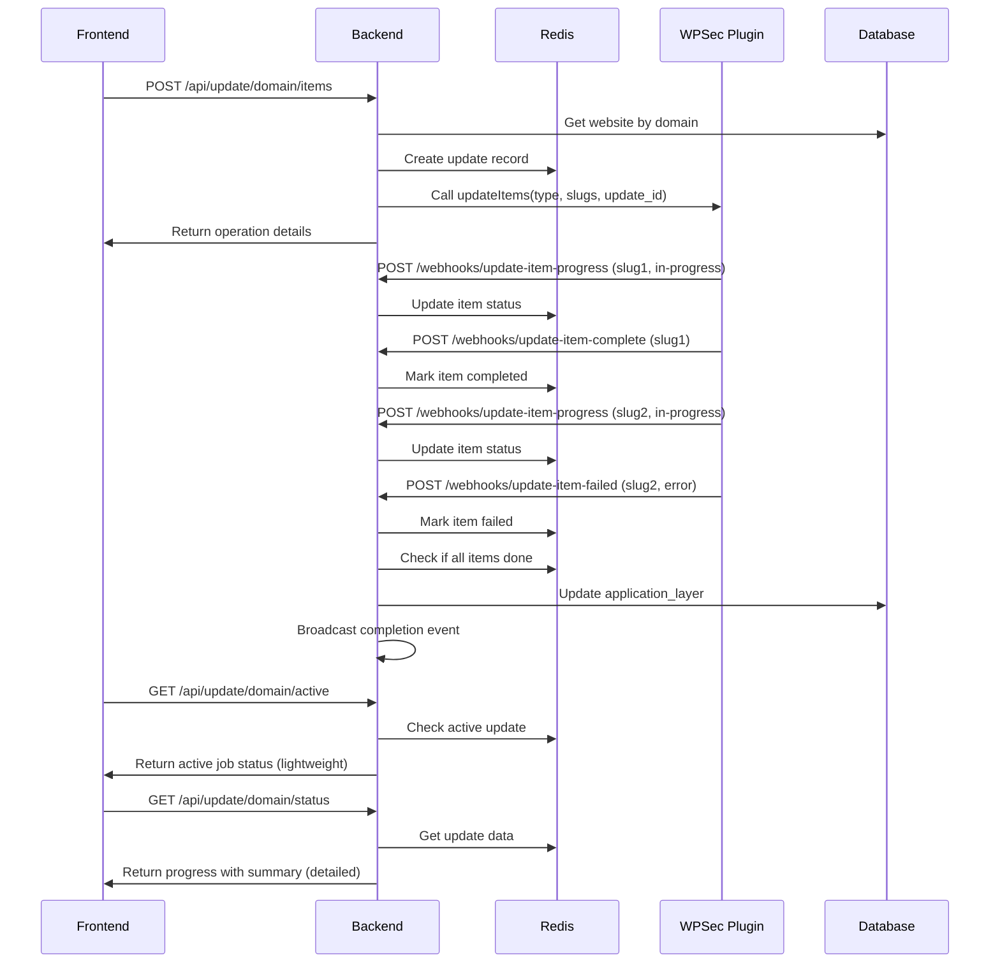

# Update Item Progress Tracking Flow

This document describes the complete flow for tracking progress of individual item updates (plugins/themes) across all components.

## Overview

The system provides asynchronous progress tracking for individual plugin/theme updates, similar to how scan operations work. The flow involves:
1. Frontend initiates item update
2. Backend creates tracking record and calls WPSec API
3. WPSec plugin performs updates and sends progress webhooks
4. Backend processes webhooks and updates progress
5. Frontend polls status endpoint for updates

## Component Flow

### 1. Frontend (Client Application)

#### Initiate Item Update
```javascript
// POST request to start item updates
const response = await fetch('/api/update/example.com/items', {
  method: 'POST',
  headers: {
    'Content-Type': 'application/json',
    'Authorization': 'Bearer <token>'
  },
  body: JSON.stringify({
    type: 'plugins', // or 'themes'
    items: ['plugin-slug-1', 'plugin-slug-2'] // array of strings or objects with slug property
  })
});

// Response format:
{
  "status": "initiated",
  "update_id": "upd_1703876543_abc123",
  "domain": "example.com",
  "type": "plugins",
  "items": ["plugin-slug-1", "plugin-slug-2"],
  "message": "Update operation started. Use the status endpoint to track progress."
}
```

#### Poll for Progress

##### Quick Active Job Check
```javascript
// GET request to quickly check if any update job is active
const activeResponse = await fetch('/api/update/example.com/active', {
  headers: {
    'Authorization': 'Bearer <token>'
  }
});

// Response format (when active):
{
  "has_active_job": true,
  "update_id": "upd_1753872114143_vlgkjkl",
  "operation_type": "items",
  "status": "in-progress",
  "started_at": "2025-07-30T10:41:54.143Z",
  "type": "plugins",
  "item_count": 1,
  "progress_summary": {
    "completed": 0,
    "failed": 0,
    "in_progress": 0,
    "initializing": 1
  }
}

// Response format (when inactive):
{
  "has_active_job": false,
  "message": "No active update job for this domain"
}
```

##### Detailed Progress Check
```javascript
// GET request to check detailed progress
const statusResponse = await fetch('/api/update/example.com/status', {
  headers: {
    'Authorization': 'Bearer <token>'
  }
});

// Response format:
{
  "status": "in-progress", // 'initializing' | 'in-progress' | 'completed' | 'failed'
  "update_id": "upd_1703876543_abc123",
  "operation_type": "items", // 'bulk' | 'items'
  "type": "plugins",
  "started_at": "2024-01-01T10:00:00.000Z",
  "completed_at": null, // or timestamp when completed
  "items": [
    {
      "slug": "plugin-slug-1",
      "status": "completed",
      "error": null
    },
    {
      "slug": "plugin-slug-2", 
      "status": "in-progress",
      "error": null
    }
  ],
  "domain": "example.com",
  "website_id": "uuid-here",
  "error": null, // overall error if operation failed
  "summary": {
    "total": 2,
    "completed": 1,
    "failed": 0,
    "in_progress": 1,
    "initializing": 0
  }
}
```

### 2. Backend (WPFort Server)

#### Step 1: Process Item Update Request
- **Endpoint**: `POST /api/update/:domain/items`
- **Handler**: `src/routes/update.ts`

**Request format:**
```json
{
  "type": "plugins",
  "items": ["plugin-slug-1", "plugin-slug-2"]
}
```

**Response format:**
```json
{
  "status": "initiated",
  "update_id": "upd_1753872114143_vlgkjkl",
  "domain": "test-wpworld.uk",
  "type": "plugins",
  "items": ["test-plugin"],
  "message": "Update operation started. Use the status endpoint to track progress."
}
```

**Flow:**
```typescript
// Processing steps:
1. Validate request (type, items)
2. Get website from database
3. Create update record in Redis via UpdateStore.createUpdate()
4. Call WPSecAPI.updateItems() with update_id
5. Return immediate response with operation details
6. Progress tracked via webhooks
```

#### Step 2: Process Progress Webhooks
Three webhook endpoints handle different stages:

##### Progress Update Webhook
- **Endpoint**: `POST /api/webhooks/update-item-progress`
- **Handler**: `src/routes/webhooks.ts`

```json
{
  "domain": "example.com",
  "slug": "plugin-slug-1",
  "status": "in-progress",
  "error": null
}
```

##### Item Completion Webhook  
- **Endpoint**: `POST /api/webhooks/update-item-complete`
- **Handler**: `src/routes/webhooks.ts`

```json
{
  "domain": "example.com",
  "slug": "plugin-slug-1"
}
```

##### Item Failure Webhook
- **Endpoint**: `POST /api/webhooks/update-item-failed`
- **Handler**: `src/routes/webhooks.ts`

```json
{
  "domain": "example.com",
  "slug": "plugin-slug-1", 
  "error_message": "Update failed: permission denied"
}
```

#### Step 3: Status Endpoints

##### Active Job Check Endpoint
- **Endpoint**: `GET /api/update/:domain/active`
- **Handler**: `src/routes/update.ts`
- **Purpose**: Quick check for active update jobs (lightweight response)

**Response when job is active:**
```json
{
  "has_active_job": true,
  "update_id": "upd_1753872114143_vlgkjkl",
  "operation_type": "items",
  "status": "in-progress",
  "started_at": "2025-07-30T10:41:54.143Z",
  "type": "plugins",
  "item_count": 1,
  "progress_summary": {
    "completed": 0,
    "failed": 0,
    "in_progress": 0,
    "initializing": 1
  }
}
```

**Response when no job is active:**
```json
{
  "has_active_job": false,
  "message": "No active update job for this domain"
}
```

##### Detailed Status Endpoint
- **Endpoint**: `GET /api/update/:domain/status`
- **Handler**: `src/routes/update.ts`
- **Purpose**: Detailed progress information including full item details

**Response format:**
```json
{
  "status": "in-progress",
  "update_id": "upd_1753872114143_vlgkjkl",
  "operation_type": "items",
  "type": "plugins",
  "started_at": "2025-07-30T10:41:54.143Z",
  "items": [
    {
      "slug": "test-plugin",
      "status": "initializing"
    }
  ],
  "domain": "test-wpworld.uk",
  "website_id": "0fb225c9-f75f-4e14-b360-f926132c4b09",
  "summary": {
    "total": 1,
    "completed": 0,
    "failed": 0,
    "in_progress": 0,
    "initializing": 1
  }
}
```

**Response when no update is in progress:**
```json
{
  "status": "none",
  "message": "No update in progress for this domain"
}
```

**Endpoint Comparison:**
- **`/active`** - Fast boolean check for job existence (lightweight)
- **`/status`** - Comprehensive progress details (full information)

### 3. WPSec Plugin (WordPress Plugin)

The WPSec plugin receives the update request and must implement progress tracking:

#### Receive Update Request
```php
// Plugin receives API call from WPFort backend
// Expected parameters:
// - type: 'plugins' or 'themes'  
// - items: array of slugs to update
// - update_id: tracking identifier for webhooks

function handle_update_items($type, $items, $update_id) {
    foreach ($items as $slug) {
        // Send progress webhook before starting each item
        send_progress_webhook($update_id, $slug, 'in-progress');
        
        try {
            // Perform the actual update
            $result = update_item($type, $slug);
            
            if ($result->success) {
                // Send completion webhook
                send_completion_webhook($update_id, $slug);
            } else {
                // Send failure webhook
                send_failure_webhook($update_id, $slug, $result->error);
            }
        } catch (Exception $e) {
            // Send failure webhook
            send_failure_webhook($update_id, $slug, $e->getMessage());
        }
    }
}
```

#### Webhook Implementations

**Option 1: Domain-based (Recommended - No update_id needed)**
```php
function send_progress_webhook($domain, $slug, $status, $error = null) {
    $payload = [
        'domain' => $domain,
        'slug' => $slug,
        'status' => $status,
        'error' => $error
    ];
    
    wp_remote_post('https://backend.wpfort.com/api/webhooks/update-item-progress', [
        'body' => json_encode($payload),
        'headers' => [
            'Content-Type' => 'application/json',
            'X-WPFort-Signature' => generate_signature($payload),
            'X-WPFort-Timestamp' => time()
        ]
    ]);
}

function send_completion_webhook($domain, $slug) {
    $payload = [
        'domain' => $domain,
        'slug' => $slug
    ];
    
    wp_remote_post('https://backend.wpfort.com/api/webhooks/update-item-complete', [
        'body' => json_encode($payload),
        'headers' => [
            'Content-Type' => 'application/json',
            'X-WPFort-Signature' => generate_signature($payload),
            'X-WPFort-Timestamp' => time()
        ]
    ]);
}

function send_failure_webhook($domain, $slug, $error_message) {
    $payload = [
        'domain' => $domain,
        'slug' => $slug,
        'error_message' => $error_message
    ];
    
    wp_remote_post('https://backend.wpfort.com/api/webhooks/update-item-failed', [
        'body' => json_encode($payload),
        'headers' => [
            'Content-Type' => 'application/json', 
            'X-WPFort-Signature' => generate_signature($payload),
            'X-WPFort-Timestamp' => time()
        ]
    ]);
}
```

**Option 2: update_id-based (If update_id is somehow available)**
```php
// Same as above but use 'update_id' instead of 'domain' in payload
```

## Data Flow Sequence



## Redis Data Structure

Updates are stored in Redis with the following structure:

```json
{
  "website_id": "uuid-of-website",
  "domain": "example.com", 
  "update_id": "upd_1703876543_abc123",
  "type": "plugins",
  "operation_type": "items",
  "items": [
    {
      "slug": "plugin-slug-1",
      "status": "completed",
      "error": null
    },
    {
      "slug": "plugin-slug-2",
      "status": "failed", 
      "error": "Update failed: permission denied"
    }
  ],
  "started_at": "2024-01-01T10:00:00.000Z",
  "status": "completed",
  "completed_at": "2024-01-01T10:05:00.000Z",
  "error": null
}
```

## Event Broadcasting

When all items are processed, the system broadcasts events:

- **Success**: `application_layer.plugins.update.completed`
- **Partial Success**: `application_layer.plugins.update.completed` 
- **Total Failure**: `application_layer.plugins.update.failed`

Event payload includes summary statistics and error details.

## Error Handling

- **API Failures**: Marked in Redis, returned in status endpoint
- **Individual Item Failures**: Tracked per-item, don't fail overall operation
- **Webhook Failures**: Logged but don't fail the operation
- **Timeout**: Redis TTL ensures cleanup (24 hours)

## Security

- All webhooks must include proper signature verification
- Uses existing webhook secret verification middleware
- API endpoints require authentication tokens

## Testing

Use these curl commands to test the flow:

```bash
# Start item update
curl -X POST http://localhost:3001/api/update/example.com/items \
  -H "Content-Type: application/json" \
  -H "Authorization: Bearer <token>" \
  -d '{"type":"plugins","items":["plugin-1","plugin-2"]}'

# Check if any job is active (quick check)
curl http://localhost:3001/api/update/example.com/active \
  -H "Authorization: Bearer <token>"

# Check detailed status  
curl http://localhost:3001/api/update/example.com/status \
  -H "Authorization: Bearer <token>"

# Simulate progress webhook
curl -X POST http://localhost:3001/api/webhooks/update-item-progress \
  -H "Content-Type: application/json" \
  -d '{"domain":"example.com","slug":"plugin-1","status":"in-progress"}'

# Simulate completion webhook
curl -X POST http://localhost:3001/api/webhooks/update-item-complete \
  -H "Content-Type: application/json" \
  -d '{"domain":"example.com","slug":"plugin-1"}'

# Simulate failure webhook
curl -X POST http://localhost:3001/api/webhooks/update-item-failed \
  -H "Content-Type: application/json" \
  -d '{"domain":"example.com","slug":"plugin-1","error_message":"Update failed"}'
```